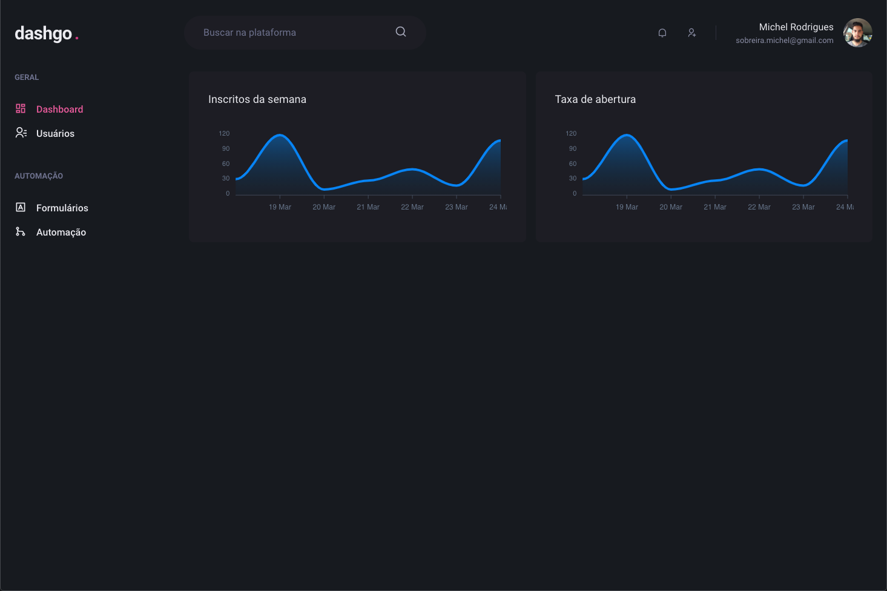
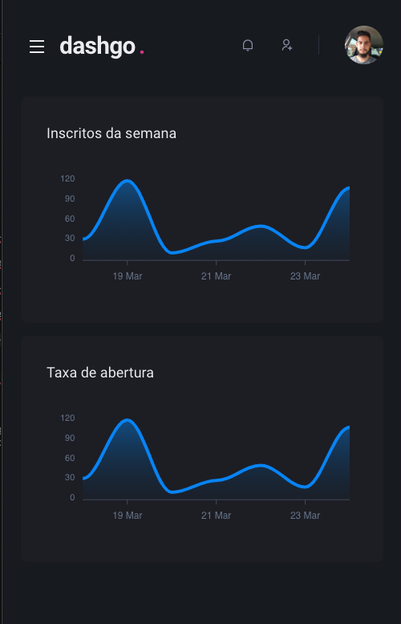
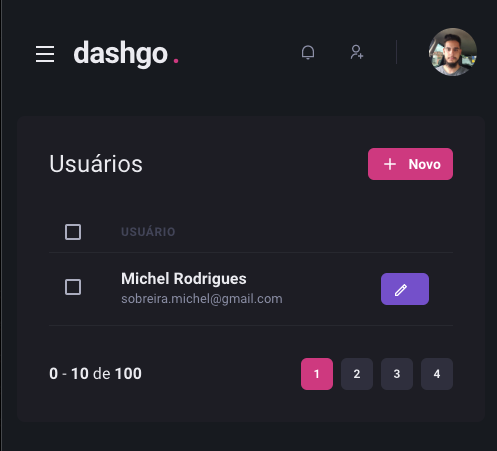
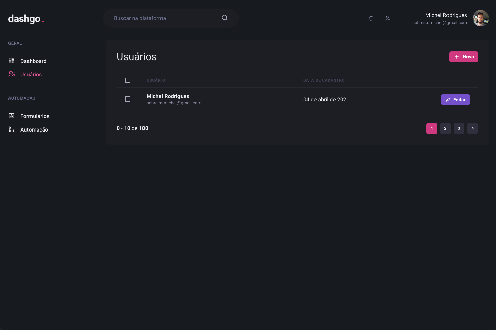

# dashgo.

<p align="center">
  
  
</p>

<p align="center">
  
  
</p>

## Techs

* [React.js](https://pt-br.reactjs.org/)
* [Next.js](https://nextjs.org/)
* [Chakra UI](https://chakra-ui.com/)


## Instalação

```sh
$ yarn install
```